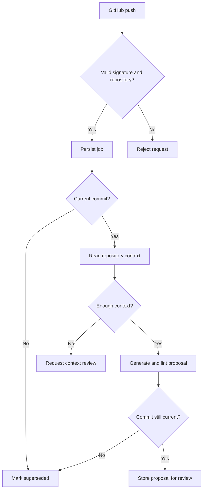

# Architecture

The first increment runs as one Node 24 TypeScript service. Node executes the
erasable TypeScript directly. SQLite stores runs and the model call budget.
There are no third-party production dependencies; TypeScript and Node types
are development dependencies.

## Source responsibilities

| File | Responsibility |
| --- | --- |
| `src/server.ts` | HTTP ingress and authenticated run access |
| `src/security.ts` | Signature, bearer token, payload scope and path checks |
| `src/store.ts` | Persistent queue, recovery, deduplication and usage cap |
| `src/github.ts` | GitHub App authentication and commit-pinned repository reads |
| `src/profile.ts` | Repository conventions and context selection |
| `src/model.ts` | Structured AI proposals and conservative proposal lint |
| `src/worker.ts` | Workflow decisions and stale-commit checks |
| `src/local.ts` | Read-only local repository inspection |
| `src/runner.ts` | Reviewed browser-run orchestration, evidence and base/head failure classification |
| `src/config.ts` | Validated deployment configuration |
| `scripts/demo.ts` | Credential-free deterministic demonstration |

## Boundaries

One repository and one GitHub installation are configured per service process.
The GitHub client has no write methods. Model-generated source is stored as
JSON data and is never imported, executed or committed by the service.

The assertion checks are conservative textual heuristics. They can flag an
obvious changed expectation but cannot prove that behaviour is correct or that
all assertions are preserved. Human review remains mandatory, including when
those checks succeed. A later executor must treat all generated code as
untrusted and use an isolated environment without model or write credentials.

Browser execution is a separate trust domain represented by `RevisionSandbox`.
The webhook/model process never invokes repository code. The adapter creates an
ephemeral environment at the requested revision, applies only human-reviewed
test files, uses reviewed install and test argument vectors, and returns artifact
paths rather than artifact contents. Reports retain exit status, retries,
Playwright report, traces, screenshots and the exact revision. If head fails,
the orchestrator runs the unchanged reviewed test at base: pass-at-base means
`application_failure`, while identical failures at both revisions mean
`outdated_tests`. Missing evidence remains `inconclusive`.

Repository files can influence test style and provide evidence of requirements;
they cannot expand the service's permissions. Source files named as common
credential files are excluded. This is not a general secret-detection system.

The worker asks GitHub for the live branch SHA rather than ordering events by
arrival time. This handles delayed deliveries without allowing an older event
to replace the newest result. A result is current at its final check; the PR
publisher must recheck the branch again before any future publication.
